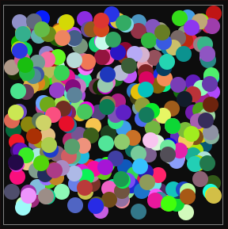

<h1 align="center">shuttlings-cch24</h1>

My solutions for the <a href="https://www.shuttle.dev/cch">Shuttle Christmas Code Hunt 2024</a>.
I used <a href="https://crates.io/crates/axum">axum</a> as my web framework.
The code may be a bit messy, but it passes all tests and bonus tasks.

For reference, here are my sprinkles from day 23, task 6: 

